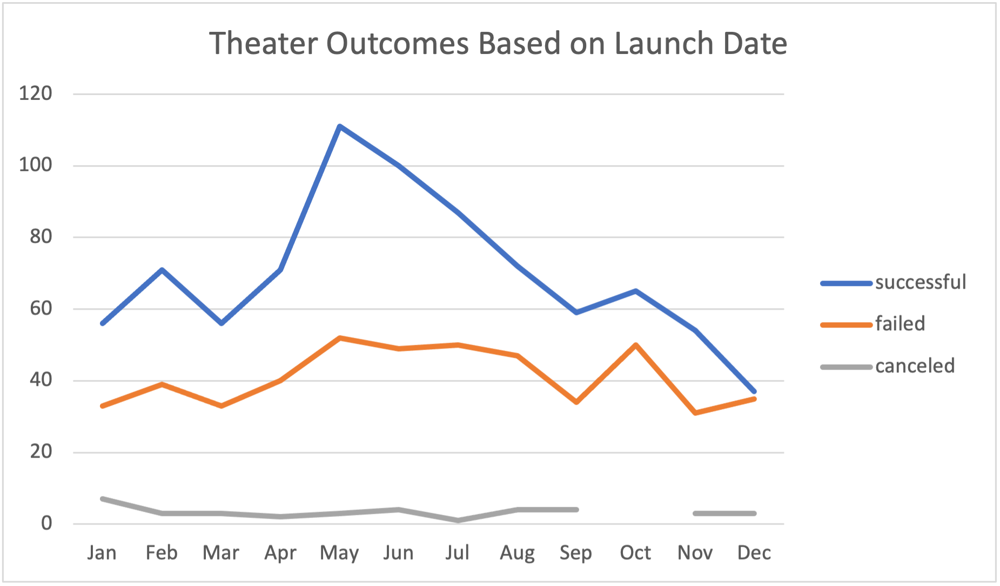
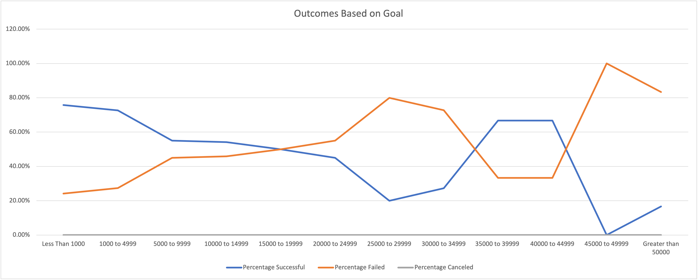

# **kickstarter-analysis**
*Performing analysis on Kickstarter data to uncover trends.*

## Overview of Project:

### *Purpose:*
The purpose of this challenge is to build upon the Excel skills learned throughout Module 1. Throughout Module 1 the goal was to help Louise plan her own successful campaign for her play *Fever*. For Louise, this challenge’s purpose was to understanding how different campaigns faired in relation to their launch dates and their fundraising goal while analyzing a dataset to discover hidden trends.

### *Project Background:*
Louise, a playwright, was seeking to launch a crowdfunding campaign to for the launch of her play *Fever*. The campaign began  with estimated budget of over $10,000. Nervous about launching a crowdfunding campaign, Louise decided to enlist help.

In an effort to determine if there are specific factors that make a campaign successful, I organized, sorted ,and analyzed crowdfunding data. Throughout Module 1 the goal was to help Louise plan her own successful campaign. 

Louise took the analysis I performed throughout Module 1 and was able to execute here own successful crowdfunding campaign for her play *Fever*.

Louise’s play *Fever* came close to its fundraising goal in short amount of time. 
Upon completing her first crowdfunding campaign, Louise wanted to know how different campaigns faired in relation to their launch dates and their fundraising goal.
 

## Analysis and Challenges:

### *Analysis Overview:*
With the purpose of this analysis defined, two deliverables became necessary to perform. 
	* Visualize campaign outcomes based on launch date
	* Visualize the percentage of successful, failed, and canceled plays based on funding goals amount.
The following steps were taken to perform the above necessary deliverables:

#### *Steps taken to Visualize Outcomes Based on Launch Date Chart:*

1. First, create a new column, "Years". Use the "YEAR()" function to extract the year from the "Date Created Conversion" column.
2. Next, create a pivot table from the current KickStarter worksheet on a new sheet "Theater Outcomes by Launch Date". 
3. This pivot table should be filtered by: "Parent Category" and "Years". 
4. The coloums and rows of this pivot table should show "Months" and the "Count of Outcomes" filtered by "successful", "failed", and "canceled".
5. To futher create the appropriate chart, filter the "Parent Category" to "theater". Outcomes shoudl be sorted in decending order and re-arranged to "successful", "failed", "canceled". 
6. Finaly, create a line chart to visualized the pivot table!  
			

#### *Steps taken to Visualize Outcomes Based on Goals Chart:*

1. This chart will require creating a new worksheet, "Outcomes Based on Goals", that will hold data for a range of goals. 
2. Next use the "COUNTIFS()" function to populate:
	* Number Successful
	* Number Failed
	* Number Canceled
3. Step two will be aided by filtering on the Kickterstarted "Outcome" coloumn, on the "Goal" amount colum using created ranges in step 1, and the "Subcategory" column with the criterai "plays".
4. Use the "SUM()" function will populate the "Total Projects" column". 
5. Calculate the percentate of successful, failed and cancled project for each row.
6. Finally, create a line chart to visualize the table!

### *Challenges and Difficulties Encountered:*
Module 1, Kickstarting with Excel, began my data analytics journey. Although I had good Excel skills before this module, I encountered new obstacles and some familiar difficulties. This was the largest data set I have worked with in recent weeks, so navigating through the data was not always seamless. On two specific occasions, my formal was not correct. Although not difficult in nature, it was frustrating as the code began to blur together making it difficult for me to debug my formula. The first formula debugging was while creating the “Years” data in column U. This data was pulling data from column S “Date Created Conversion”. I failed to add the second “/60”. After re-reading the formula multiple times I finally was able to debug and enter the correct formula: “ =(((J2/60/60)/24)+DATE(1970,1,1)) “ inside the column S “Date Created Conversion”. Once this formula was correct column S and U worked properly. The second formula debugging occurred while working with the ‘Outcomes Based on Goals tab’. The COUNTIFS function used to create column B-D was simply to understand, however arranging the criteria and range correctly proved challenging. The challenges I encountered within this module revolved around navigating through a large data set and pinpointing formula failure through debugging. Altogether these challenges were likely relatively simple compared to the challenges to come.

## Results:

*What are two conclusions you can draw about the Theater Outcomes by Launch Date?*
* May was the most successfful month to launch a campaign.
* May was also a month of high failed campaigns.  

*What can you conclude about the Outcomes based on Goals?*
* There is a 50%+ success rate of campaings of campaings less than $15,000 and for campaings beteen $35,000 - $45,000. The hightest successful campaign, approximaly 75%, have goal of less than $1,000. While goals beteen $45,000 - $50,000 have a failed rate of 100%. 

*What are some limitations of this dataset?*
* This dataset, although dense, is not able to provide everything needed. to copy-and-past a succesful camapgin. Not all variables were defined for cross-over analysis. This limited the knowledge of what each data set reprepresented. 

*What are some other possible tables and/or graphs that we could create?*
* Additaional visalizations that used length of campaign and number of campaign recipents would  allow for a deeper understanding of what a successful campaign looks like. A graph that told the story of the various type of doners could help determine and understand the sucessful goals reached. 
